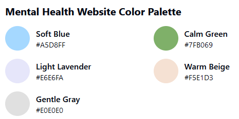
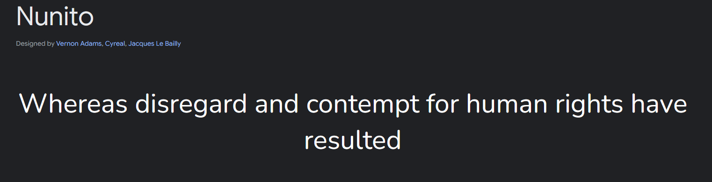
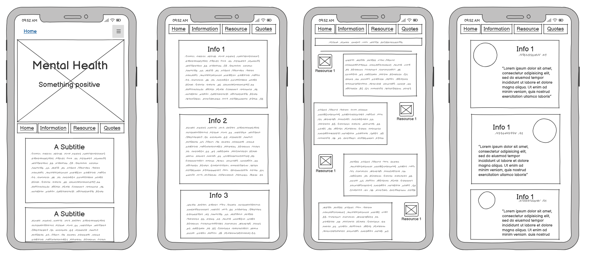

# Mind Space

Mind-space is a simple, one page website which aims to provide users with some basic information regarding mental health. The site maintains a calm theme and provides users with a peaceful space to learn. Mind-space also provides links to other resources and organisations which can be used to learn more or access help. Finally, Mind-space provides a short section with positive quotes from famous and influential figures. 

## Planning
### Colour Palette

The colour palette was generated by Claude.ai with direction of creating a calming colour scheme which would be appropriate for a website about mental health while maintaining good contrast values for the text on the body of the page.

### Font Choice

I chose a simple, easy to read font from GoogleFonts. I relied on the clear character outlines and lack of serifs in order the make the page as accessible as possible.

### Wire Framing

Because I was planning to build with bootstrap, I did my initial wireframing only for mobile. When I came to creating the website I had a clear idea of how bootstrap would work for mobile and then I only had to write the rules which would allow the mobile format to expand to a larger screen. 

During the building process the website took a slightly different form to what I had planned. This was due, primarily to my over reliance on bootstrap cards in the planning process. I hadn't realised how one dimensional these would make the site so I opted for a carousel for my final section.

## UX/UI - User Stories
- As a user I want to learn more about mental health topics.
  - The cards where the primary solution to this user story. They allow for concise snippets of information without overwhelming the reader.

- As a user I want to be able to find resources to help me with my mental health
  - The resource links, again in cards, allow the reader to get a little information about each website before they choose to visit them. On clicking the link the website opens in a separate tab to that the user doesn't have to leave the website entirely.

- As a user I want to be able to navigate the information easily.
  - The nav bar is the primary point of navigation for the user. I decided to position it below the hero image as I wanted the introduction to the site to be as calming and clutter free as possible. The sticking of the nav bar upon scrolling past it was    essential in making sure that when the user is fully set on browsing the site that they can re-navigate at will.

- As a user I want to be able to contact the website developer.
  - I wanted to ensure that the user had seen the extent of the site before leaving any feedback as scrolling through the content may answer any questions that they may have. For this reason I only included the 'contact us' section in the footer nav bar.

- As a user I want to be able to understand how to help myself and others when it comes to mental health issues. 
  - The 'tips to help' portion of the cards was included so that users could get a quick idea of necessary steps to take when faced with one of the mental health issues that I covered. With this information they would then be able to follow one of the resource links below to get the appropriate care.

## Features 

### Existing Features

- __Hero section__

  - The hero section of the website provides an introduction for the user. When first viewed they are presented with a calming photograph, the website name and an invitation to learn more.

- __Navigation bar__

  - The nav bar sits below the hero section and provides the user with links to all the different portions of the page. Upon scrolling past the Nav bar it will stick to the top of the screen so that the user can reorientate themselves no matter where they are on the page.
  - On the Nav bar there is also a link which opens a modal where the users can contact the website creator and leave feedback.

- __Information Cards__

  - Created using bootstrap, the information cards will provide a broad overview of mental health topics and issues.
  - The cards will be brief in content and encourage the reader to learn more on each topic by using the links below.

- __Resource Links__

  - The four resource links will allow the reader to gain a more in-depth understanding of the topics covered if they wish and will link them to an external page.

- __Quotes__ 

  - The quotes section will be a carousel where the user can scroll through various positive quotes from famous people.

- __Footer__

  - The footer will hold a condensed version of the nav bar with the additional option of a contact us modal. There will also be a copyright section.

- __Contact Modal__

  - The contact modal would be accessible from the bottom nav bar. A pop-up window would allow the user to fill in a form with their name, email address and a message. 

### Further Features

- __Collapsable Cards__

  - I would like to add a collapse function to the 'tips to help' section of the information cards so that they take up less space on the screen but can be accessed by the user if they wish as they do not hold essential information.

## Testing 

The majority of the testing process was conducted while the website was still being produced. Using a local test server and the developer tools built into the browser I was able to effectively test the responsiveness on a range of devices. Various visual issues were also identified during this process. I ran some code through AI models like Claude and ChatGPT in order to identify typing errors or missed divs which I could not see myself.

Early deployment on Github Pages was essential to see how the website would be viewed by a user and helped me to highlight further issues such as broken file pathways.

I also tested the website on physical devices to get a feeling for how easy it was to navigate. This was particularly important when deciding to resize the font of the nav bar on smaller screens.

### Colour Contrast Testing
- Text contrast was checked using the [WebAIM tool](https://webaim.org/resources/contrastchecker/).

### Accessiblity Testing
- Accessibility testing was done using the [WAVE Tool](https://wave.webaim.org/).

### Validator Testing 

- HTML
  - No errors were returned when passing through the official [W3C validator](https://validator.w3.org/nu/?doc=https%3A%2F%2Fcodefish-fullstack.github.io%2Fmental-health-project%2F)
- CSS
  - No errors were found when passing through the official [(Jigsaw) validator](https://jigsaw.w3.org/css-validator/validator?uri=https%3A%2F%2Fcodefish-fullstack.github.io%2Fmental-health-project%2F&profile=css3svg&usermedium=all&warning=1&vextwarning=&lang=en)

### Unfixed Bugs

- Using landscape display on mobile devices causes the subheading in the hero section to clash with the nav bar and information section.

- When clicking a link in the top nav bar the nav bar will cover the section heading.

- Font colour of the quote citation needs adjusting as the contrast is poor against the background.

## Deployment

- The site was deployed to GitHub pages. The steps to deploy are as follows: 
  - In the GitHub repository, navigate to the Settings tab 
  - From the source section drop-down menu, select the Master Branch
  - Once the master branch has been selected, the page will be automatically refreshed with a detailed ribbon display to indicate the successful deployment. 

The live link can be found here - [Mind-Space](https://codefish-fullstack.github.io/mental-health-project/)

## Credits 

This project aims to provide basic and informative information about mental health to the reader. In order to provide the most accurate information possible, the majority of the text content is copied from reliable sources which are linked below. The media, colour schemes and icons for the site were taken from by a variety of online sources which provide them as a free service.

### Content 
- The text for the webpage was generated by ClaudeAI
- The quotes were taken from, 'A Room of One's Own by Virginia Woolf, 'A Hat Full of Sky' by Terry Pratchett and 'The End' by John Lennon and Paul McCartney
- The icons in the footer were taken from [Font Awesome](https://fontawesome.com/)

### Media

- The photos used on the home page are from [Pexels](https://www.pexels.com/)
- Images for the resources and quotes were sourced from [Wikipedia](https://en.wikipedia.org/wiki/Main_Page)
- The fonts used throughout are sourced from [GoogleFonts](https://fonts.google.com/)
- The colour palette was generated by [ClaudeAI](https://claude.ai/)
- The favicon was generated by [Favicon.io](https://favicon.io/favicon-generator/)
